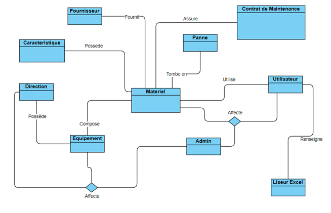
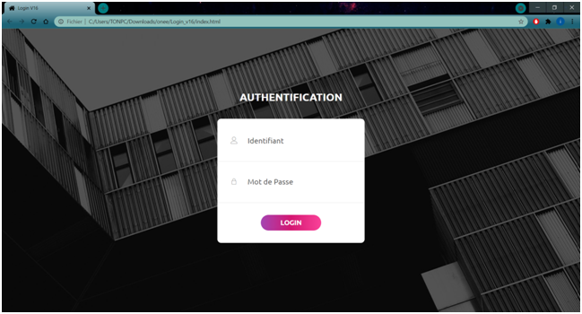
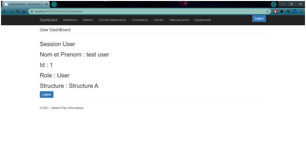
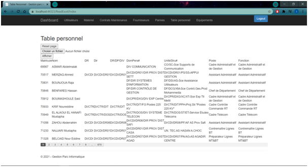
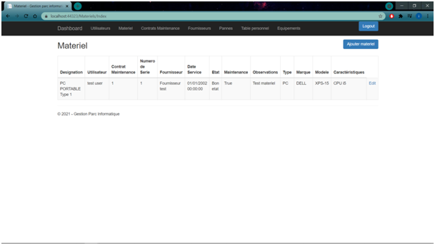
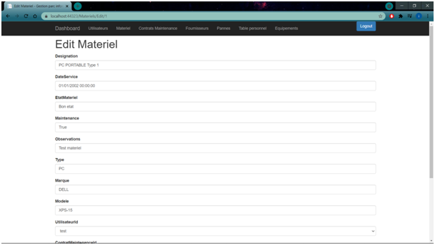
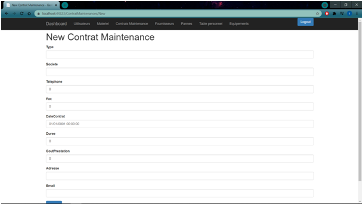

Stage technique : Conception et réalisation d’une application Web pour la gestion du Parc Informatique de l’ONEE.

La généralisation de la micro-informatique, des outils à tous les niveaux de l’ONEE-BE nécessite la connaissance et la maitrise technique, administrative et financière de ce parc et de détenir les informations nécessaires à sa maîtrise et son évolution 

Dans ce contexte, sont demandés les outils/ Applications permettant une  gestion optimisée du parc informatique et entre autres les bénéfices suivants :

•	Visibilité complète du parc informatique.
•	Optimisation du temps de travail et de l’efficacité des ressources support technique.
•	Optimisation de la productivité des utilisateurs.
•	Maîtrise de la valeur réelle de l’infrastructure.
•	Maîtrise des coûts de fonctionnement et réduction des coûts de possession.

Conception

Authentification

Dashboard

Tableau Personnel

Exemple Index materiel

Exemple modification materiel

Exemple Ajout Contrat

